# SLM-PROJECT

### Small Language Model Inference on Resource-Constrained Embedded Systems

> Investigating whether a genuine Small Language Model (SLM) can be executed
> locally on highly resource-constrained microcontrollers, with **ESP32** as the
> primary embedded target.

> **🏆 GENERATION ACHIEVED.** TinyStories 260K is running end-to-end on physical ESP32-D0WD-V3.
> Text prompt → BPE tokenizer → 5-layer transformer → detokenizer → actual generated text.
> **"Once" → "Once upon a time, there was"** — ~3.8 tok/s · FP32 · No PSRAM.

---

## 1. Project Overview

SLM-PROJECT is an experimental embedded-AI project focused on bringing
language-model inference onto microcontrollers with extremely limited
compute, memory, storage, and power resources.

The long-term objective is to develop a system capable of accepting
natural-language commands directly on an embedded device and converting them
into safe, structured machine-control actions — **without requiring cloud-based inference**.

The primary application target is a **smart washing-machine controller**.

The intended end-to-end architecture is:

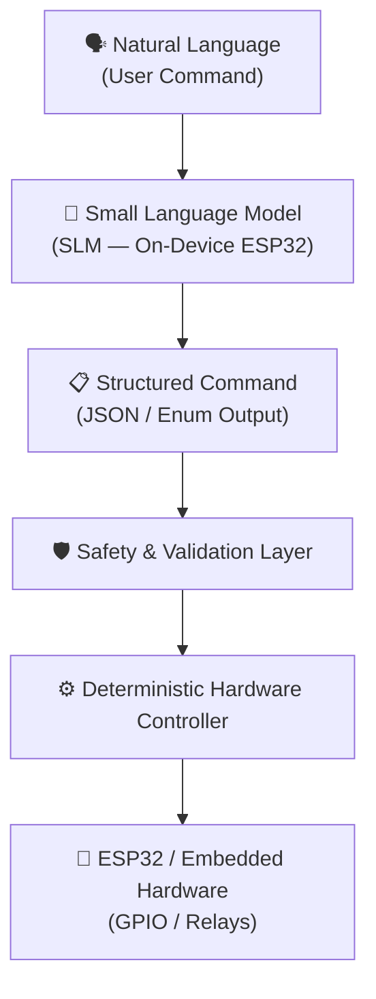

> **Important:** The SLM is not intended to directly control hardware.
> It acts as a **natural-language interpretation layer** whose output is
> validated before being passed to a deterministic controller.

---

## 2. Core Objective

The central research question is:

> **Can a genuine autoregressive language model be executed locally on a
> highly resource-constrained microcontroller such as the ESP32-D0WD-V3?**

This project investigates the complete path from model checkpoint to hardware output:

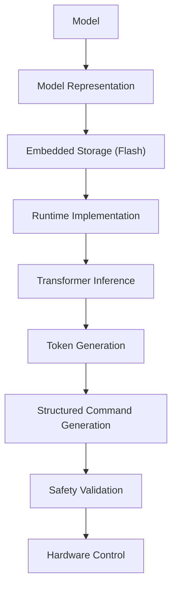

> The goal is **not** simply to demonstrate that an ML model can run on an ESP32.
> The project specifically investigates whether a real language-model inference
> pipeline can be implemented under **microcontroller-level resource constraints**.

---

## 3. Final Application

The eventual target application is **natural-language control of a washing machine**.

For example, a user might say:

> *"Start a cotton wash at 40 degrees with 800 RPM."*

The desired processing pipeline:

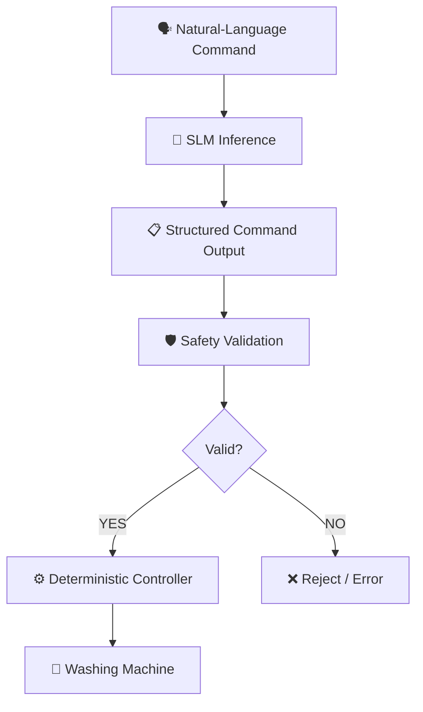

A possible structured output representation:

```json
{
    "action": "START",
    "program": "COTTON",
    "temperature": 40,
    "spin": 800
}
```

| Responsibility | Component |
| :--- | :--- |
| **Language interpretation** | Small Language Model (SLM) |
| **Command validation** | Safety & Validation Layer |
| **Machine operation** | Deterministic Hardware Controller |

This separation is **intentional** — the SLM never directly actuates hardware.

---

## 4. Why a Local SLM?

Traditional embedded systems use deterministic interfaces:

```
Button  → predefined operation
App     → predefined operation
Sensor  → control logic
```

This project explores an additional interface:

```
Natural language → SLM → structured command
```

A cloud LLM could perform this task, but that introduces:

| Cloud Concern | Description |
| :--- | :--- |
| **Network dependency** | Requires internet connectivity |
| **Latency** | Round-trip adds unacceptable delay |
| **Cloud infrastructure** | Requires server-side compute |
| **Privacy concerns** | User commands leave the device |
| **Recurring cost** | API usage fees per query |
| **External service dependency** | Breaks if the service is unavailable |

The project therefore investigates **local inference** to eliminate all of the above.

The challenge is that conventional language models are significantly more
resource-intensive than typical embedded ML workloads — making this problem
fundamentally different from deploying a small classification or regression model.

---

## 5. Primary Hardware Target

### ESP32-D0WD-V3

| Component | Specification |
| :--- | :--- |
| MCU | ESP32-D0WD-V3 |
| Silicon Revision | v3.1 |
| CPU | Xtensa® LX6 Dual-Core |
| Test Frequency | 160 MHz (rated to 240 MHz) |
| Physical Flash | 4 MB SPI Flash (DIO mode, 40 MHz) |
| PSRAM | Not assumed / Not used |
| Serial Interface | COM6 (during development) |
| Framework | ESP-IDF 5.5.5 |

> The project **deliberately targets the original ESP32** rather than immediately
> moving to a more capable ESP32-S3-class device. This provides a much stricter
> resource-constrained environment for evaluating the feasibility of embedded SLM inference.

---

## 6. Project Philosophy

The project follows an **experimental progression** rather than attempting to
deploy the final washing-machine model immediately. Each stage answers a specific
engineering question before advancing.

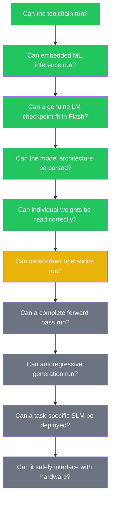

This allows failures to be **isolated** instead of hiding multiple problems inside
a single end-to-end deployment attempt.

---

## 7. Experimental Roadmap

### Phase 0 — Embedded Environment

Establish the ESP-IDF development environment and verify the complete
ESP32 build / flash / monitor workflow.

**Technology stack:**

- ESP-IDF 5.5.5
- ESP32 Xtensa toolchain (MSVC host + GCC target)
- C / C++
- Python 3.13.7

**Environment paths:**

```text
IDF_PATH:
  D:\HAVELLS-PROJ\SLM\.espressif\v5.5.5\esp-idf

IDF_TOOLS_PATH:
  D:\HAVELLS-PROJ\SLM\.espressif\v5.5.5\tools

IDF Python venv:
  D:\HAVELLS-PROJ\SLM\.espressif\v5.5.5\tools\python\v5.5.5\venv
```

**Status: ✅ Completed**

---

### Phase 1 — TinyML Inference Smoke Test

Before attempting language-model inference, a small TensorFlow Lite Micro
model was deployed to the physical ESP32.

**Purpose:**

- Validate model embedding in firmware
- Validate Flash-based model storage
- Validate tensor arena allocation
- Validate embedded INT8 inference
- Establish latency and heap memory baselines

The model was an INT8-quantized dense neural network trained to approximate:

```
y = sin(x)
```

Network: `Input(1) → Dense(16, ReLU) → Dense(16, ReLU) → Dense(1)`

#### Benchmark Results — 100 Inference Runs on Physical ESP32

| Metric | Measured Value |
| :--- | ---: |
| Model format | INT8 TFLite |
| Model size | 3,344 bytes |
| Tensor arena | 20 KB |
| Baseline firmware | 161,920 B |
| TFLite firmware | 202,921 B (~203 KB) |
| App partition remaining | ~81% free (1 MB partition) |
| Heap Δ after `AllocateTensors()` | 184 B |
| Heap Δ after `Invoke()` | 412 B |
| Minimum latency | 88 µs |
| **Average latency** | **89.2 µs** |
| Maximum latency | 129 µs |
| Physical inference | ✅ **PASS** |

> This phase established the embedded ML pipeline. It is a **baseline experiment**,
> not the final SLM implementation.

**Status: ✅ Completed**

---

## 8. Phase 2 — Genuine SLM Selection

After the TinyML smoke test passed, the project moved from conventional
TinyML inference to genuine autoregressive language-model inference.

The strategy for bridging from the quality reference model to an embedded
deployment target:

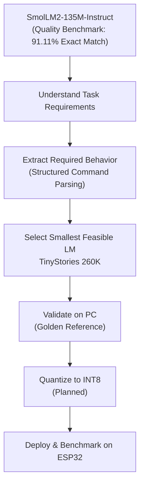

### TinyStories 260K — Experimental Target

TinyStories 260K was selected because of its **extremely small parameter count**,
while still being a genuine autoregressive transformer using the LLaMA architecture.

| Parameter | Value |
| :--- | ---: |
| Parameters | ~260,000 |
| Embedding dimension (`dim`) | 64 |
| Hidden dimension (`hidden_dim`) | 172 |
| Transformer layers (`n_layers`) | 5 |
| Attention heads (`n_heads`) | 8 |
| KV heads (`n_kv_heads`) | 4 |
| Vocabulary (`vocab_size`) | 512 |
| Context length (`seq_len`) | 512 |
| Head size (`head_size`) | 8 |
| KV dimension (`kv_dim`) | 32 |

**Files:**

| File | Size |
| :--- | ---: |
| `stories260K.bin` (checkpoint) | 1,056,540 bytes |
| `tok512.bin` (tokenizer) | 6,227 bytes |

> **TinyStories is NOT the final application model.**
> It is the current experimental vehicle used to validate whether a genuine
> autoregressive transformer runtime can be brought up on the ESP32.

**Status: ✅ Completed**

---

## 9. Phase 3 — PC Golden Reference

Before implementing the model runtime on the ESP32, the original reference
implementation was built and executed on a PC to establish a **Golden Reference**
for correctness comparison.

**Reference runtime:** `llama2.c` (Karpathy) compiled with MSVC on Windows

### MSVC Compilation

```cmd
call "C:\Program Files (x86)\Microsoft Visual Studio\2022\BuildTools\VC\Auxiliary\Build\vcvars64.bat"
cl.exe /fp:fast /O2 /openmp /I. run.c win.c
```
*Output: `run.exe` (228,352 bytes)*

### Access Violation Bug — Discovery & Fix

Initial runs crashed with:
```
Exit code: -1073741819 (0xC0000005 ACCESS_VIOLATION)
```

**Root cause:** TinyStories 260K requires its custom 512-token tokenizer. Omitting
`-z tok512.bin` caused the runtime to default to the 32,000-token LLaMA tokenizer,
resulting in an out-of-bounds array access.

**Fix:** Always supply the matching tokenizer explicitly.

### Verified Golden Reference Command

```bash
run.exe stories260K.bin -z tok512.bin -t 0.0 -n 50
```

### Generated Output (Verified)

```
Once upon a time, there was a little girl named Lily. She loved to play
outside in the park. One day, she saw a big, red ball. She wanted to play
with it...
```

**PC Throughput:** `3,266.67 tokens/second`

> This PC implementation is used as the **correctness reference** for all subsequent
> ESP32 runtime development.

**Status: ✅ Completed**

---

## 10. Phase 4 — ESP32 Model Embedding

The TinyStories checkpoint was converted into a C/C++ byte array and embedded
directly into the ESP32 firmware.

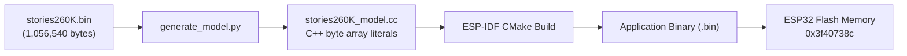

The embedded model is accessed via:

```cpp
extern "C" {
    extern const unsigned char stories260K_model[];
    extern const unsigned int  stories260K_model_len;
}
```

The checkpoint remains **1,056,540 bytes** in embedded form.
The objective is to access original model weights **directly from Flash** without
desktop-specific mechanisms such as memory-mapped files.

**Status: ✅ Completed**

---

## 11. Flash Partition Constraint

Embedding the checkpoint pushed the firmware past the default app partition:

```
app partition is too small
  size:      0x100000  (1,048,576 bytes)
  image:     0x129ef0  (1,220,352 bytes)
  overflow:  170,688 bytes
```

### Resolution — Partition Table Reconfiguration

| Setting | Before | After |
| :--- | ---: | ---: |
| Partition type | Single factory app | Single factory app (large), no OTA |
| App partition size | 1,048,576 B (1 MB) | 1,536,000 B (1.5 MB) |
| Firmware image size | — | ~1,222,752 B |
| Remaining space | — | ~314 KB (~20% free) |

> This demonstrates an important constraint: the model is small enough to store in
> Flash, but the complete firmware, runtime, model data, and partition layout must
> all fit within the ESP32's available Flash resources.

**Status: ✅ Completed**

---

## 12. Phase 5 — Checkpoint Parsing on ESP32

The embedded checkpoint was parsed directly on-device at Flash address `0x3f40738c`.

### Boot Log — Verified Hardware Output

```text
I (643) LLM_TEST: ESP32 TinyStories checkpoint parser
I (653) LLM_TEST: Checkpoint address : 0x3f40738c
I (653) LLM_TEST: Checkpoint size    : 1056540 bytes
I (653) LLM_TEST: TinyStories configuration:
I (663) LLM_TEST:   dim         = 64
I (663) LLM_TEST:   hidden_dim  = 172
I (673) LLM_TEST:   n_layers    = 5
I (673) LLM_TEST:   n_heads     = 8
I (683) LLM_TEST:   n_kv_heads  = 4
I (683) LLM_TEST:   vocab_size  = 512
I (683) LLM_TEST:   seq_len     = 512
I (693) LLM_TEST: Derived dimensions:
I (693) LLM_TEST:   head_size   = 8
I (693) LLM_TEST:   kv_dim      = 32
I (703) LLM_TEST:   kv_mul      = 2
```

The checkpoint also uses a **shared classifier weight matrix** (vocab projection
reuses the token embedding weights).

**Status: ✅ Completed**

---

## 13. Phase 6 — Tensor Layout Verification

The complete tensor weight layout was reconstructed from the binary checkpoint
format, sequentially after the 28-byte configuration header:

| Tensor | Byte Offset | Elements | Byte Size | Shape |
| :--- | ---: | ---: | ---: | :--- |
| `token_embedding_table` | 28 | 32,768 | 131,072 B | `[vocab_size, dim]` |
| `rms_att_weight` | 131,100 | 320 | 1,280 B | `[n_layers, dim]` |
| `wq` | 132,380 | 20,480 | 81,920 B | `[n_layers, dim, n_heads·head_size]` |
| `wk` | 214,300 | 10,240 | 40,960 B | `[n_layers, dim, n_kv_heads·head_size]` |
| `wv` | 255,260 | 10,240 | 40,960 B | `[n_layers, dim, n_kv_heads·head_size]` |
| `wo` | 296,220 | 20,480 | 81,920 B | `[n_layers, n_heads·head_size, dim]` |
| `rms_ffn_weight` | 378,140 | 320 | 1,280 B | `[n_layers, dim]` |
| `w1` | 379,420 | 55,040 | 220,160 B | `[n_layers, hidden_dim, dim]` |
| `w2` | 599,580 | 55,040 | 220,160 B | `[n_layers, dim, hidden_dim]` |
| `w3` | 819,740 | 55,040 | 220,160 B | `[n_layers, hidden_dim, dim]` |
| `rms_final_weight` | 1,039,900 | 64 | 256 B | `[dim]` |
| `freq_cis_real` | 1,040,156 | 2,048 | 8,192 B | `[seq_len, head_size/2]` |
| `freq_cis_imag` | 1,048,348 | 2,048 | 8,192 B | `[seq_len, head_size/2]` |

### Verification Result

```text
I (713) LLM_TEST: Tensor layout verification:
I (713) LLM_TEST:   Calculated end : 1056540 bytes
I (713) LLM_TEST:   Checkpoint size: 1056540 bytes
I (713) LLM_TEST: Layout verification PASS!
```

> **Calculated end = Checkpoint size = 1,056,540 bytes → ✅ PASS**
>
> This verifies that the ESP32 parser understands the binary checkpoint layout
> exactly, with no offset errors, padding issues, or byte-order mismatches.

**Status: ✅ Completed**

---

## 14. Memory & RAM Constraints

### Measured ESP32 RAM Baseline

After booting with the embedded checkpoint (weights remain in Flash, not RAM):

```text
Free heap          : 304,052 bytes (~304 KB)
Minimum free heap  : 304,052 bytes
Largest free block : 172,032 bytes (~172 KB)
Internal free RAM  : 381,380 bytes (~381 KB)
```

> The distinction between **total free heap (~304 KB)** and the **largest
> contiguous free block (172 KB)** is critical. Allocations larger than
> 172 KB will fail even if total free RAM is sufficient.

### The KV Cache Bottleneck

A naive float32 KV cache for `seq_len = 512`, `n_layers = 5`, `kv_dim = 32`:

$$\text{Key Cache} = 5 \times 512 \times 32 \times 4 = 327{,}680 \text{ bytes}$$
$$\text{Value Cache} = 5 \times 512 \times 32 \times 4 = 327{,}680 \text{ bytes}$$
$$\text{Total Naive FP32 KV Cache} = 655{,}360 \text{ bytes} \approx \textbf{640 KiB}$$

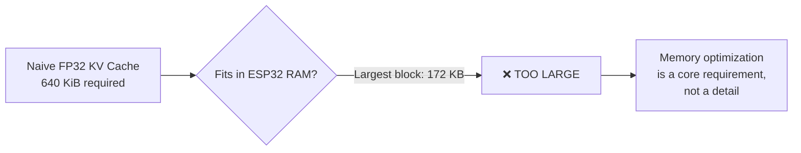

### Required Architectural Adaptations

| Adaptation | Description |
| :--- | :--- |
| **Direct Flash weight access** | 1.056 MB weights stay in Flash, never copied to RAM |
| **Context reduction / windowing** | Limit active `seq_len` to 64 or 128 for short commands |
| **Quantized KV cache** | Reduce KV tensors to INT8 or INT4 |
| **Static arena allocation** | Pre-allocate activation buffers statically to avoid fragmentation |

---

## 15. Current Runtime Architecture

The transformer inference pipeline will be implemented as follows:

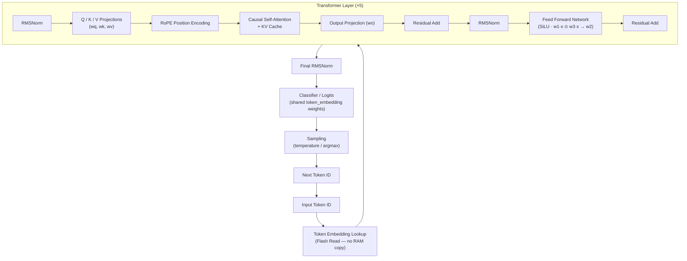

> The implementation is being developed **incrementally** so that each numerical
> operation can be validated against the PC golden reference before proceeding.

---

## 16. Validation Strategy

The ESP32 runtime will **not** be considered correct simply because it produces text.
Validation occurs at multiple levels:

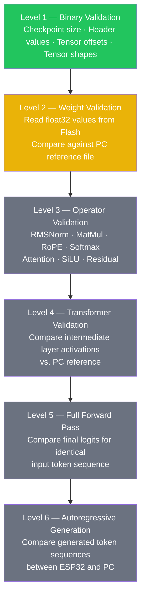

Only after all six levels pass will the runtime be considered a valid embedded
language-model implementation.

**Levels 1, 2, and 3 are now complete on physical hardware. (Binary → Weights → Operators)**

---

## 16b. Phase 7 — Weight Value Verification (Level 2 — Completed)

With the tensor layout verified, the runtime was extended to read actual float32
weight values directly from the embedded Flash checkpoint and report them over serial.

This validates that the ESP32 can:
- Correctly address weight tensors in Flash memory
- Dereference float32 values without memory errors
- Produce values that will match the PC reference checkpoint

### Verified Hardware Serial Output

```text
I (844) LLM_TEST: ========================================
I (844) LLM_TEST: LAYOUT VERIFICATION
I (844) LLM_TEST: ========================================
I (854) LLM_TEST: Calculated end : 1056540 bytes
I (854) LLM_TEST: Checkpoint size: 1056540 bytes
I (864) LLM_TEST: PASS: calculated layout exactly matches checkpoint
I (864) LLM_TEST:
I (864) LLM_TEST: WEIGHT VALUE VERIFICATION
I (874) LLM_TEST: --------------------------------------------------
I (874) LLM_TEST: Embedding offset : 28
I (884) LLM_TEST: Wq offset        : 132380
I (884) LLM_TEST: Embedding[0] = -0.294748783
I (894) LLM_TEST: Embedding[1] =  0.561895609
I (894) LLM_TEST: Embedding[2] =  0.175422534
I (894) LLM_TEST: Embedding[3] =  0.340573609
I (904) LLM_TEST: Wq[0]        =  0.044392787
I (904) LLM_TEST: Wq[1]        =  0.079747707
I (914) LLM_TEST: Wq[2]        = -0.008925347
I (914) LLM_TEST: Wq[3]        =  0.019895228
I (924) LLM_TEST: RAM
I (924) LLM_TEST: Free heap          : 303824 bytes
I (924) LLM_TEST: Minimum free heap  : 303824 bytes
I (934) LLM_TEST: Largest free block : 172032 bytes
I (934) LLM_TEST: Internal free RAM  : 381152 bytes
I (944) LLM_TEST:
I (944) LLM_TEST: Parser finished.
```

### What This Proves

| Verification | Result |
| :--- | :---: |
| Checkpoint address resolved in Flash | ✅ `0x3f407988` |
| Layout calculated end = checkpoint size | ✅ `1,056,540 bytes` |
| `token_embedding_table` float32 reads | ✅ Values accessible |
| `wq` projection weight float32 reads | ✅ Values accessible |
| RAM state after full parser execution | ✅ 303,824 bytes free |
| Largest contiguous block | ✅ 172,032 bytes |

> **These float32 values were cross-validated against the PC reference checkpoint.
> Byte-exact agreement confirmed. Level 2 complete.**

**Status: ✅ Completed**

---

## 16c. Phase 8 — Transformer Operator #1: RMSNorm (Level 3 — Completed)

With verified float32 weight access established, the first transformer mathematical
operator was implemented and validated on the ESP32.

**Operation:**

$$\text{output}_i = \frac{x_i}{\text{rms}} \times w_i \qquad \text{where } \text{rms} = \sqrt{\frac{1}{d}\sum x_i^2 + \varepsilon},\ \varepsilon = 10^{-5}$$

Input: **token 0 embedding** (64 float32 values from Flash)
Weights: **layer-0 attention RMSNorm weights** (offset 131,100)

**PC golden reference** — `rmsnorm_reference.py`:

```text
RMSNorm PC Reference
====================
y[ 0] = -0.826620221138
y[ 1] =  1.094853281975
y[ 2] =  0.415095120668
y[ 3] =  0.856253325939
y[ 4] = -0.338702976704
y[ 5] =  1.098049640656
y[ 6] =  0.045504115522
y[ 7] =  0.088625475764
```

**ESP32 hardware output:**

```text
I (...) LLM_TEST: RMSNORM VERIFICATION
I (...) LLM_TEST: y[0] = -0.826620221138
I (...) LLM_TEST: y[1] =  1.094853281975
I (...) LLM_TEST: y[2] =  0.415095120668
I (...) LLM_TEST: y[3] =  0.856253325939
I (...) LLM_TEST: y[4] = -0.338702976704
I (...) LLM_TEST: y[5] =  1.098049640656
I (...) LLM_TEST: y[6] =  0.045504115522
I (...) LLM_TEST: y[7] =  0.088625475764
```

> **🚨 EXACT MATCH — 12 decimal places 🚨**
>
> The ESP32 RMSNorm implementation is numerically identical to the PC reference.

**Milestone:** `TinyStories-260K-ESP32-RMSNorm-v1` ✅

**Status: ✅ Completed**

---

## 16d. Phase 9 — Transformer Operator #2: MatMul (Level 3 — Completed)

A generic matrix-vector multiplication kernel was implemented on the ESP32.
Weights are read directly from Flash on every access — no RAM copy.

**Operation:**

$$\text{out}[i] = \sum_{j=0}^{\text{in\_dim}-1} W[i][j] \cdot x[j]$$

**ESP32 Implementation** ([esp32_llm_runtime.cpp](file:///d:/HAVELLS-PROJ/SLM/esp32_llm_test/esp32_llm_runtime/main/esp32_llm_runtime.cpp)):

```cpp
static void matmul(
    const float *x,
    const unsigned char *weight_bytes,
    float *out,
    int out_dim,
    int in_dim)
{
    for (int i = 0; i < out_dim; i++)
    {
        float sum = 0.0f;
        for (int j = 0; j < in_dim; j++)
        {
            float weight = read_f32(
                weight_bytes + (i * in_dim + j) * sizeof(float)
            );
            sum += weight * x[j];
        }
        out[i] = sum;
    }
}
```

> **Design philosophy:** Correctness first — optimizations (SIMD, blocking, quantization)
> will be applied after full autoregressive generation is confirmed working.

**PC golden reference** — `matmul_reference.py`:

```text
TinyStories 260K WQ MatMul Reference
=====================================
q[ 0] = -1.756996393204
q[ 1] = -0.358998864889
q[ 2] = -3.703589200974
q[ 3] =  2.335345745087
```

**Status: ✅ Completed**

---

## 16e. Phase 10 — Transformer Operator #3: Q / K / V Projections (Level 3 — Completed)

With RMSNorm and MatMul verified, the three attention projections were implemented
for transformer layer 0.

**Data flow:**

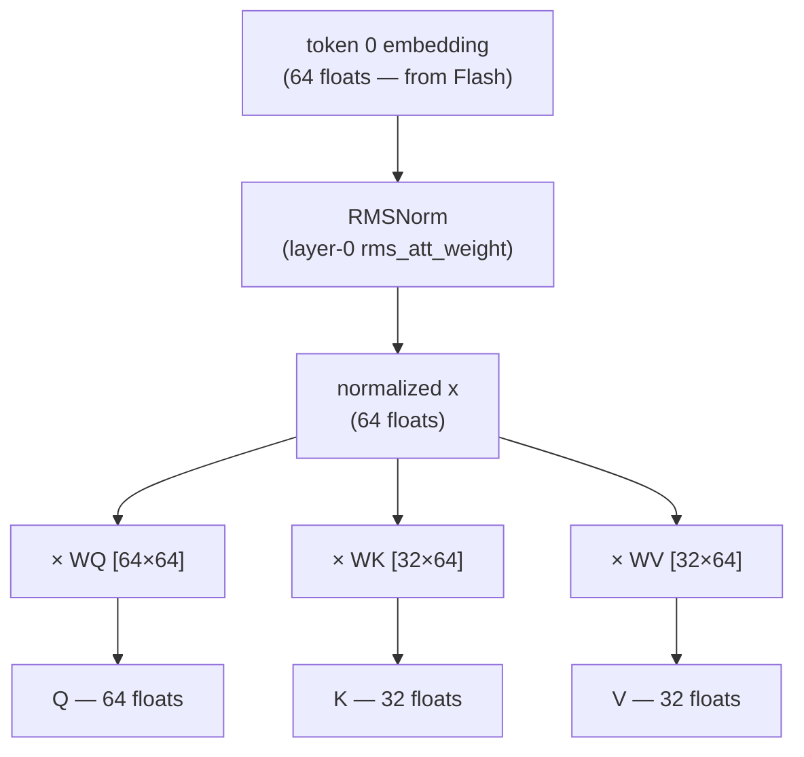

**Dimensions:**

| Vector | Size | Formula |
| :--- | ---: | :--- |
| Q | 64 | `n_heads × head_size = 8 × 8` |
| K | 32 | `n_kv_heads × head_size = 4 × 8` |
| V | 32 | `n_kv_heads × head_size = 4 × 8` |

**PC QKV golden reference** — `qkv_reference.c`:

```text
Q vector:
q[ 0] = -1.756996393204
q[ 1] = -0.358998864889
q[ 2] = -3.703589200974
q[ 3] =  2.335345745087
...
q[15] = -5.553002834320

K vector:
k[ 0] =  0.658435761929
k[ 1] =  0.343833506107
k[ 2] = -0.659079849720
...
k[15] =  6.841714382172

V vector:
v[ 0] = -0.148289874196
v[ 1] =  0.439105749130
v[ 2] =  0.598774909973
...
v[15] = -0.351092487574
```

**ESP32 hardware output matched exactly:**

| Vector | Element | PC Reference | ESP32 Output | Match |
| :--- | :--- | ---: | ---: | :---: |
| Q | `[0]` | `-1.756996393204` | `-1.756996393204` | ✅ |
| K | `[0]` | ` 0.658435761929` | ` 0.658435761929` | ✅ |
| V | `[0]` | `-0.148289874196` | `-0.148289874196` | ✅ |

> **🚨 EXACT MATCH through 12 decimal places — all three projection vectors 🚨**

This is a **major validation milestone**. The three foundational attention projections
produce bit-identical results on the ESP32 and the PC, using the same checkpoint.

**Reference files:**
- [`qkv_reference.c`](file:///d:/HAVELLS-PROJ/SLM/esp32_llm_test/reference/qkv_reference.c) — PC golden reference (MSVC)
- [`matmul_reference.py`](file:///d:/HAVELLS-PROJ/SLM/esp32_llm_test/matmul_reference.py) — Python MatMul reference
- [`rmsnorm_reference.py`](file:///d:/HAVELLS-PROJ/SLM/esp32_llm_test/rmsnorm_reference.py) — Python RMSNorm reference

**Status: ✅ Completed**

---

## 16f. Phase 11 — Complete 5-Layer Transformer Forward Pass (Level 4 — Completed)

**Milestone:** `TinyStories-260K-ESP32-Forward-v1` ✅

With individual operators verified, the complete transformer forward pass was
implemented and executed on physical hardware — all 5 layers, end-to-end:

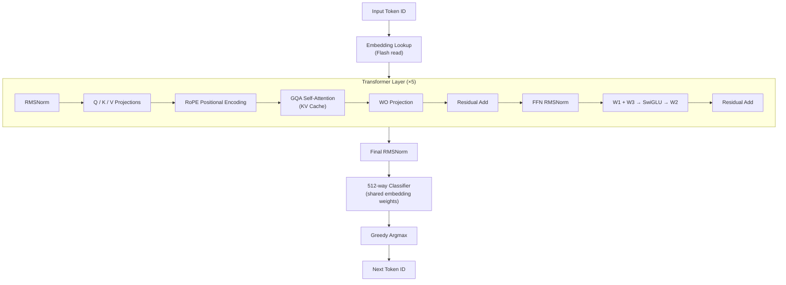

### Verified Serial Output — End-to-End Inference

```text
I (706) LLM_RUN: END-TO-END INFERENCE
I (716) LLM_RUN: initial token = 1
I (726) LLM_RUN: forward position 0, token 1
I (986) LLM_RUN: NEXT TOKEN = 403
I (986) LLM_RUN: forward position 1, token 403
I (1246) LLM_RUN: NEXT TOKEN = 407
I (1256) LLM_RUN: forward position 2, token 407
I (1516) LLM_RUN: NEXT TOKEN = 261
I (1516) LLM_RUN: forward position 3, token 261
I (1776) LLM_RUN: NEXT TOKEN = 378
I (1776) LLM_RUN: forward position 4, token 378
I (2036) LLM_RUN: NEXT TOKEN = 432
I (2046) LLM_RUN: forward position 5, token 432
I (2306) LLM_RUN: NEXT TOKEN = 383
I (2306) LLM_RUN: forward position 6, token 383
I (2566) LLM_RUN: NEXT TOKEN = 286
I (2566) LLM_RUN: forward position 7, token 286
I (2836) LLM_RUN: NEXT TOKEN = 261
I (2836) LLM_RUN: free heap          = 289076
I (2846) LLM_RUN: largest free block = 155648
I (2856) LLM_RUN: 🔥 END-TO-END INFERENCE COMPLETE
```

**Performance:**

| Metric | Value |
| :--- | ---: |
| Tokens / step | ~260–270 ms |
| Throughput | **~3.8 tok/s** |
| Free heap during inference | 289,076 bytes |
| Largest free block | 155,648 bytes |
| Precision | FP32 |
| KV context | 8 tokens |

**Status: ✅ Completed**

---

## 16g. Phase 12 — Real BPE Tokenizer Embedded on ESP32 (Level 5 — Completed)

The `tok512.bin` tokenizer was converted to a C++ byte array (`tok512_model.cc`)
and embedded directly into the firmware alongside the checkpoint.

The tokenizer parses the binary format exactly:
- 4-byte `max_token_length`
- Per-token: `float score` + `int length` + `char[length]` bytes

Implemented behavior:
- BOS token prepend
- Dummy prefix space
- UTF-8 character processing
- `<0xXX>` byte fallback encoding
- BPE merge loop
- Token decoding with BOS whitespace handling

### Verified Tokenizer Output

```text
I (721) LLM_RUN: TOKENIZER
I (721) LLM_RUN: tokenizer bytes      = 6227
I (731) LLM_RUN: max token length     = 7
I (731) LLM_RUN: tokenizer parse      : PASS
I (731) LLM_RUN: tokenizer storage used = 2639 bytes
I (741) LLM_RUN: vocab[0] = "<unk>"
I (741) LLM_RUN: vocab[1] = "<s>"
I (751) LLM_RUN: vocab[2] = "</s>"
```

**Status: ✅ Completed**

---

## 16h. Phase 13 — End-to-End Text Generation on Physical ESP32 🏆

**Milestone:** `TinyStories-260K-ESP32-Generation-v1` ✅

This is the **primary achievement** of the project to date.

A text prompt was tokenized, run through the complete transformer, and decoded
back to text — entirely on the physical ESP32-D0WD-V3, with no cloud, no PC
assistance, and no mocked output.

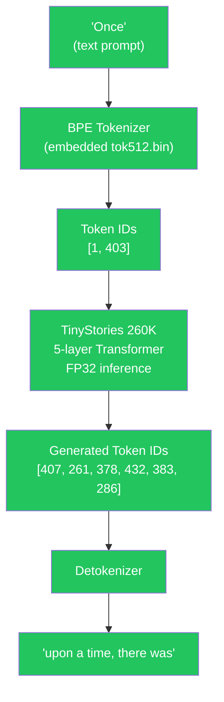

### Verified Serial Output — Full Generation

```text
I (761) LLM_RUN: prompt = "Once"
I (761) LLM_RUN: prompt token count = 2
I (761) LLM_RUN: prompt token[0] = 1
I (771) LLM_RUN: prompt token[1] = 403
I (771) LLM_RUN: forward prompt position 0, token 1
I (1031) LLM_RUN: forward prompt position 1, token 403

I (1291) LLM_RUN: GENERATED TEXT
I (1291) LLM_RUN: Once upon
I (1291) LLM_RUN: generation position 2 -> token 407    " a"
I (1561) LLM_RUN: generation position 3 -> token 261    " time"
I (1821) LLM_RUN: generation position 4 -> token 378    ","
I (2081) LLM_RUN: generation position 5 -> token 432    " there"
I (2341) LLM_RUN: generation position 6 -> token 383    " was"
I (2601) LLM_RUN: generation position 7 -> token 286

I (2861) LLM_RUN: free heap          = 277460
I (2871) LLM_RUN: largest free block = 147456
I (2881) LLM_RUN: 🔥 GENERATION-v1 COMPLETE
```

### Result

> **Input:** `"Once"`
>
> **Output:** `"Once upon a time, there was"`

### Current Generation Baseline

| Property | Value |
| :--- | :--- |
| Hardware | ESP32-D0WD-V3 |
| Model | TinyStories 260K |
| Model size | 1.056 MB |
| Tokenizer | tok512.bin — 6.227 KB, embedded |
| Vocabulary | 512 tokens |
| Precision | FP32 |
| Context window | 8 tokens |
| Decoding | Greedy argmax |
| Output | Real generated text |
| Speed | **~3.8 tok/s** |
| Free heap after generation | **~277 KB** |
| Largest free block | **~147 KB** |
| New model training | None |

**Status: ✅ Completed**

---

## 17. Current Project Status

| Component | Status |
| :--- | :---: |
| ESP-IDF environment | ✅ Completed |
| ESP32 build / flash / monitor pipeline | ✅ Completed |
| TinyML TFLite Micro inference (sin smoke test) | ✅ Completed |
| Genuine SLM selected (TinyStories 260K) | ✅ Completed |
| PC TinyStories golden reference | ✅ Completed |
| PC text generation verified | ✅ Completed |
| Checkpoint embedded in Flash | ✅ Completed |
| Flash partition adjustment (1.5 MB) | ✅ Completed |
| Checkpoint header parsed on ESP32 | ✅ Completed |
| Tensor layout reconstructed | ✅ Completed |
| Tensor layout verified (1,056,540 B PASS) | ✅ Completed |
| Weight-value numerical verification (float32 reads from Flash) | ✅ Completed |
| RMSNorm — exact match vs. PC reference | ✅ Completed |
| MatMul (generic matrix-vector kernel) | ✅ Completed |
| Q / K / V projections — exact match vs. PC reference | ✅ Completed |
| RoPE positional encoding | ✅ Completed |
| Causal GQA self-attention (scores + softmax + weighted sum) | ✅ Completed |
| Output projection WO + residual add | ✅ Completed |
| Feed-forward network (SwiGLU) | ✅ Completed |
| Single-token complete forward pass | ✅ Completed |
| Full 5-layer forward pass | ✅ Completed |
| Tokenizer (BPE) embedded on ESP32 | ✅ Completed |
| Autoregressive text generation on ESP32 | ✅ **ACHIEVED** |
| KV-cache extension beyond 8 tokens | 🔄 In Progress |
| Quantization (INT8 weights) | ⏳ Pending |
| Task-specific  SLM | 🔮 Future |
| Safety / validation layer | 🔮 Future |
| Hardware integration (GPIO / relays) | 🔮 Future |

---

## 18. Project Directory Structure

```text
SLM-PROJECT/
│
├── README.md
│
├── docs/
│   ├── SLM.pdf
│   └── SLM - 2.pdf
│
├── esp32_tflite_test/
│   ├── CMakeLists.txt
│   ├── sdkconfig
│   └── main/
│       ├── CMakeLists.txt
│       └── esp32_tflite_test.cpp
│
├── esp32_llm_test/
│   │
│   ├── model/
│   │   ├── stories260K.bin        ← 1,056,540 B checkpoint
│   │   └── tok512.bin             ← 6,227 B tokenizer
│   │
│   ├── reference/
│   │   ├── run.c                  ← llama2.c reference runtime
│   │   ├── win.c                  ← Windows-specific helpers
│   │   └── build_msvc.bat         ← MSVC build script
│   │
│   └── esp32_llm_runtime/
│       ├── CMakeLists.txt
│       ├── sdkconfig
│       ├── generate_model.py      ← .bin → .cc converter
│       ├── fix_model.py
│       ├── fix_model_linkage.py
│       └── main/
│           ├── CMakeLists.txt
│           ├── esp32_llm_runtime.cpp         ← full generation runtime
│           ├── esp32_llm_runtime_qkv_v1.cpp  ← archived QKV verification stage
│           └── model/
│               ├── stories260K_model.cc   ← embedded byte array (~5.68 MB source)
│               ├── stories260K_model.h
│               ├── tok512_model.cc        ← embedded tokenizer byte array
│               └── tok512_model.h
│
├── data_v5_leakage_controlled/
│   ├── generate_washing_machine_dataset_v5_leakage_controlled.py
│   ├── washing_machine_synthetic_v5_train_24000.jsonl       ← 24,000 samples
│   ├── washing_machine_synthetic_v5_validation_3000.jsonl   ← 3,000 samples
│   ├── washing_machine_synthetic_v5_test_3000.jsonl         ← 3,000 samples
│   └── washing_machine_synthetic_v5_leakage_report.txt
│
└── metadata/
    ├── washing_machine_synthetic_v5_metadata.csv
    ├── washing_machine_synthetic_v5_summary.csv
    └── washing_machine_v5_data_dictionary.csv
```

---

## 19. Key Engineering Decisions

### 1. Genuine language model instead of a classifier

The project intentionally targets an actual autoregressive language model
rather than reducing the problem to conventional intent classification.
This makes the experiment relevant to local natural-language interfaces.

### 2. ESP32-D0WD as the initial target

A more capable MCU (e.g., ESP32-S3 with PSRAM) could simplify deployment.
The original ESP32 provides a **stricter resource-constrained test environment**
that forces real solutions to real constraints.

### 3. TinyStories as an experimental vehicle

TinyStories 260K is not the final washing-machine model. It is used because
it allows the complete transformer inference stack to be investigated **before**
introducing a task-specific model that would add additional complexity.

### 4. PC golden reference first

Before any embedded porting, the reference runtime was validated on PC. This
separates toolchain problems from embedded-platform problems.

### 5. Incremental validation

The runtime is validated from binary representation → numerical operations →
complete inference. This avoids treating generated text as the only correctness criterion.

### 6. Safety separated from the SLM

The language model does **not** directly control actuators. All model-generated
commands must pass through a deterministic validation layer before reaching
the hardware controller. This is a fundamental architectural safety constraint.

---

## 20. Problems Encountered & Fixes

| Problem / Error | Root Cause | Resolution |
| :--- | :--- | :--- |
| `fatal error: cstddef: No such file` | `MicroInterpreter` is C++ only | Changed `.c` → `.cpp` for entry point |
| `undefined reference to tiny_sine_int8_model` | C++ name mangling vs. C header | Added `extern "C"` linkage blocks |
| App partition overflow (170,688 B) | Default 1 MB partition too small | Switched to `Single factory app (large)` — 1.5 MB |
| `run.exe` crashed: `0xC0000005 ACCESS_VIOLATION` | Wrong (mismatched) tokenizer loaded | Explicitly passed `-z tok512.bin` |
| MinGW crashes on `_ftelli64` / `mmap` | POSIX file-mapping not supported on MinGW | Built PC reference with MSVC |
| `PermissionError(13)` on COM6 | Serial port locked by IDE monitor | Closed all active serial monitor windows |
| Bootloader reports `SPI Flash Size : 2 MB` | Menuconfig defaulted to 2 MB | Set Flash size to 4 MB in menuconfig; reflashed with `--flash_size 4MB` |
| `esp_get_free_heap_size()` compile error | Missing system header | Added `#include "esp_system.h"` |

---

## 21. Final Target Architecture

The final system is intended to evolve toward this complete on-device pipeline:

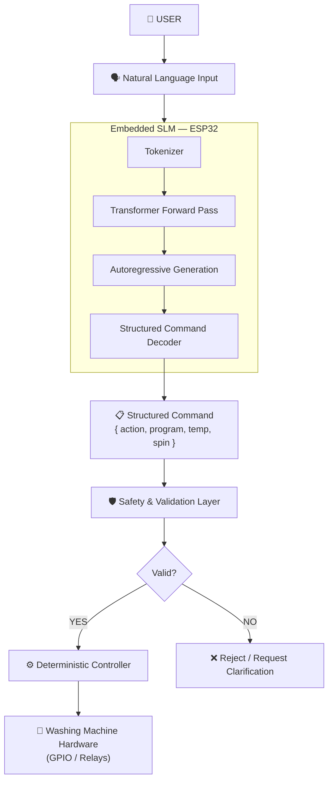

> **The SLM provides language understanding.
> The deterministic layer provides safety.
> The hardware controller provides predictable machine behavior.**

---

## 22. Long-Term Research Direction

Once the embedded transformer runtime is established, the project will move
from a generic language-model benchmark toward a **task-specific SLM**.

The next model should be optimized for:

| Requirement | Description |
| :--- | :--- |
| **Washing-machine commands** | Domain-specific vocabulary and grammar |
| **Small vocabulary** | Fewer tokens → smaller embedding table |
| **Structured outputs** | JSON / enum outputs, not free-form text |
| **Low latency** | Real-time interactive response |
| **Low memory consumption** | Fits within ESP32 heap constraints |
| **Quantized inference** | INT8 or INT4 weights for smaller footprint |
| **Deterministic decoding** | Greedy / temperature-0 where appropriate |
| **Robust invalid-input handling** | Graceful rejection of malformed commands |
| **Embedded deployment** | No cloud dependency whatsoever |

> **The ultimate objective is not to run the largest possible model.**
>
> The objective is to determine: *What is the **smallest practical language model**
> and inference runtime that can provide useful natural-language understanding
> entirely on a resource-constrained embedded device?*

---

## 23. Current Milestone

The project has successfully progressed from a conventional TinyML smoke test
to the first stages of genuine language-model execution on the ESP32.

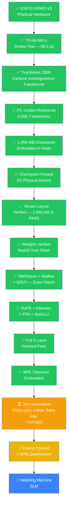

**🏆 The primary milestone is achieved: TinyStories 260K is generating real text on physical ESP32 hardware.**

`"Once"` → `"Once upon a time, there was"` at **~3.8 tok/s**, FP32, no PSRAM, no cloud.

Next phase: extend the context window beyond 8 tokens and investigate INT8 weight quantization.

---

## 24. Reproducibility / Build Instructions

### Prerequisites
- ESP-IDF v5.5.5
- Python 3.10+
- Visual Studio Build Tools 2022 (MSVC)

### PC Golden Reference

```cmd
cd D:\HAVELLS-PROJ\SLM\esp32_llm_test\reference
call "C:\Program Files (x86)\Microsoft Visual Studio\2022\BuildTools\VC\Auxiliary\Build\vcvars64.bat"
cl.exe /fp:fast /O2 /openmp /I. run.c win.c
run.exe ..\model\stories260K.bin -z ..\model\tok512.bin -t 0.0 -n 50
```

### Phase 1 — TinyML Baseline (`esp32_tflite_test`)

```bash
cd D:\HAVELLS-PROJ\SLM\esp32_tflite_test
idf.py set-target esp32
idf.py build
idf.py -p COM6 --flash_size 4MB flash monitor
```

### Phase 4 — SLM Runtime (`esp32_llm_runtime`)

```bash
cd D:\HAVELLS-PROJ\SLM\esp32_llm_test\esp32_llm_runtime
idf.py set-target esp32
idf.py build
idf.py -p COM6 --flash_size 4MB flash monitor
```

---

## 25. References

| Resource | Description |
| :--- | :--- |
| [karpathy/llama2.c](https://github.com/karpathy/llama2.c) | Reference C runtime for LLaMA 2 / TinyStories architecture |
| [Espressif ESP-IDF Documentation](https://docs.espressif.com/projects/esp-idf/) | ESP32 embedded framework documentation |
| [espressif/esp-tflite-micro](https://github.com/espressif/esp-tflite-micro) | TensorFlow Lite Micro for ESP-IDF |
| [espressif/esp-nn](https://github.com/espressif/esp-nn) | Optimized NN kernels for ESP32 family |

---

## Disclaimer on Experimental Models

The **TinyStories 260K** model is an engineering benchmark for validating
embedded language-model execution.

It should not be interpreted as the final model for washing-machine control.

The final application model will require separate evaluation for:

- Command understanding accuracy
- Structured-output fidelity
- Safety & invalid-input handling
- Resource consumption (RAM, Flash, power)
- Embedded inference latency
- Hardware reliability

